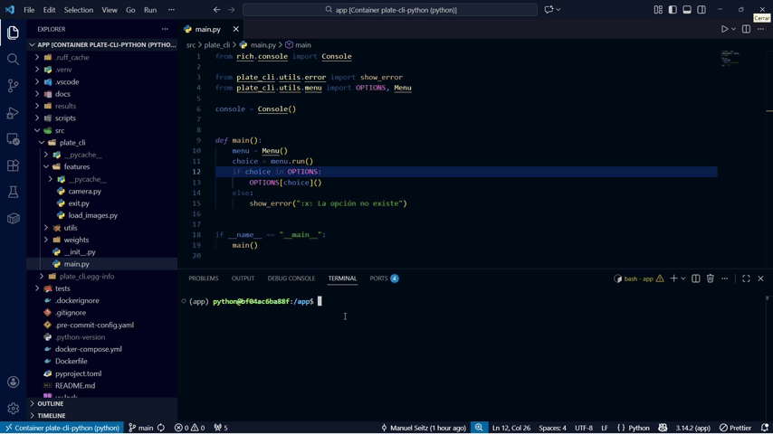

<h1 align="center">PlateCLI</h1>

<p align="center">
  
  
  
</p>

<p align="center">
  
</p>

## Descripción

PlateCLI es una herramienta de línea de comandos desarrollada en Python para la detección y reconocimiento de placas de matrículas vehiculares. Utiliza modelos de machine learning para identificar placas en imágenes o videos en tiempo real, y extrae el texto mediante OCR (Reconocimiento Óptico de Caracteres).

### Propósito

El propósito principal de PlateCLI es proporcionar una interfaz sencilla y eficiente para procesar imágenes y detectar placas de matrículas, facilitando tareas como el monitoreo vehicular, control de acceso o análisis de datos en aplicaciones de visión por computadora.

## Instalación

### Prerrequisitos

- Python 3.14 o superior
- Un entorno virtual recomendado (venv o conda)

### Instalación desde el código fuente

1\. Clona el repositorio:

```bash
git clone https://github.com/ManuelSeitz/PlateCLI
cd plate-cli
```

2\. Instala las dependencias:

```bash
pip install -e .
```

O usando uv (recomendado):

```bash
uv sync
```

## Uso

Después de la instalación, ejecuta el comando `plate-cli` en la terminal:

```bash
plate-cli
```

Esto abrirá un menú interactivo donde podrás seleccionar opciones como:

- Cargar imágenes para análisis
- Usar la cámara en tiempo real
- Procesar lotes de imágenes

## Tecnologías utilizadas

- **Python 3.14+**: Lenguaje de programación principal
- **Ultralytics YOLO**: Para detección de objetos (placas de matrículas)
- **EasyOCR**: Para reconocimiento óptico de caracteres
- **Rich**: Para el diseño de la interfaz de terminal
- **Prompt Toolkit**: Para prompts interactivos
- **Selenium**: Para scraping web (usado en recolección de datos)
- **Ruff**: Para linting y formateo de código

## Estructura del proyecto

- `src/plate_cli/`: Código fuente principal del CLI
- `scripts/`: Scripts auxiliares para scraping, entrenamiento y generación de datos
- `tests/`: Pruebas unitarias
- `docs/`: Documentación e imágenes
- `weights/`: Modelos preentrenados

## Licencia

Este proyecto está bajo la Licencia MIT. Ver el archivo [LICENSE](https://github.com/ManuelSeitz/PlateCLI/blob/main/LICENSE) para más detalles.
